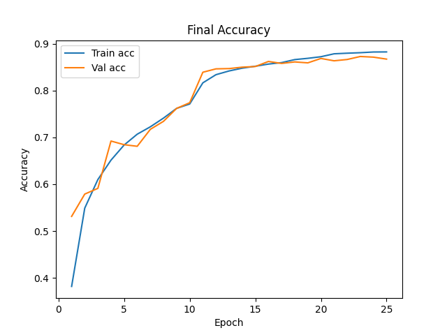
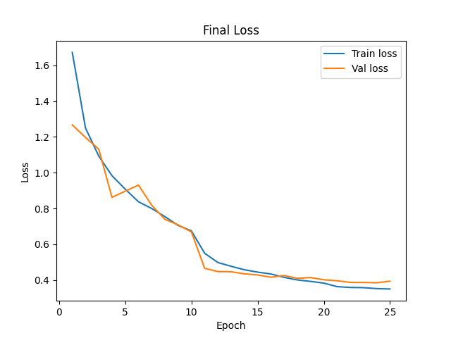
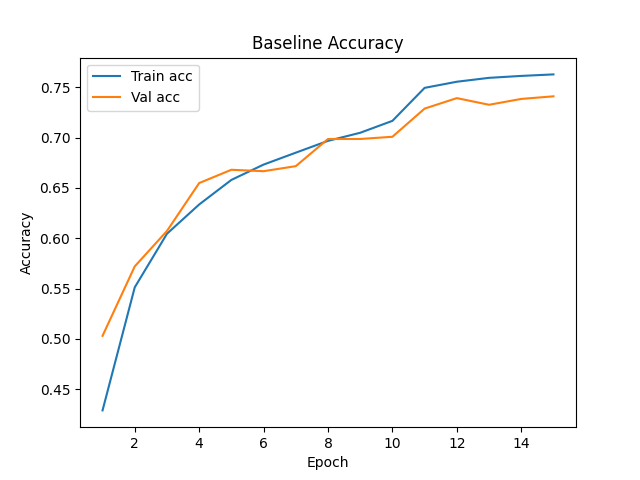
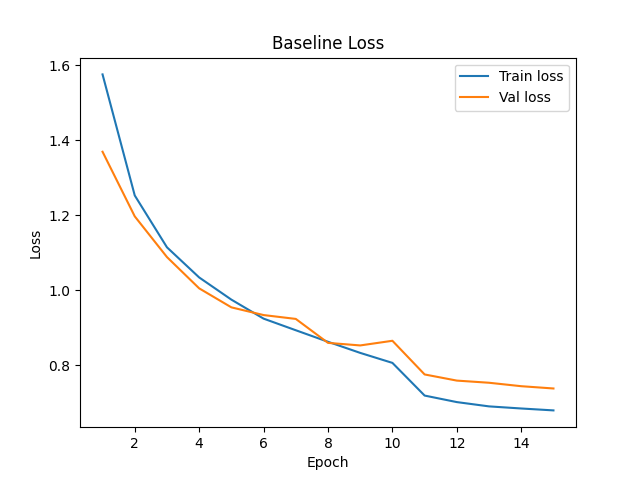
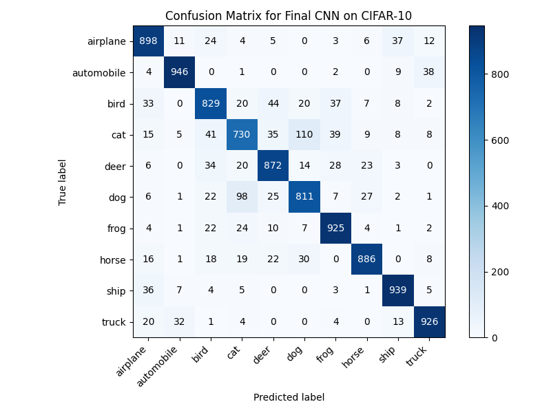

# CIFAR-10 CNN Classification

CNN-based CIFAR-10 image classification with performance analysis and model improvements.

> Built to explore CNN architectures and training strategies for image classification.

## Overview
This project implements and evaluates convolutional neural networks for CIFAR-10 image classification using PyTorch.  
It compares a baseline CNN with an improved model using stronger training strategies and regularization techniques.

## Results
- Baseline test accuracy: **76.33%**
- Final test accuracy: **87.17%**
- Improvement: **+10.84 percentage points**

## Techniques Used
- Data augmentation
- Batch normalization
- Dropout
- Adam optimizer
- Learning rate scheduling

## Project Files
- `cifar10_cnn_classification.py` — main training and evaluation script
- `report.pdf` — detailed project report
- `images/` — plots and confusion matrix

## Sample Results

### Final Accuracy Curve


### Final Loss Curve


### Baseline Accuracy Curve


### Baseline Loss Curve


### Confusion Matrix


## How to Run

Install dependencies:
```bash
pip install -r requirements.txt
